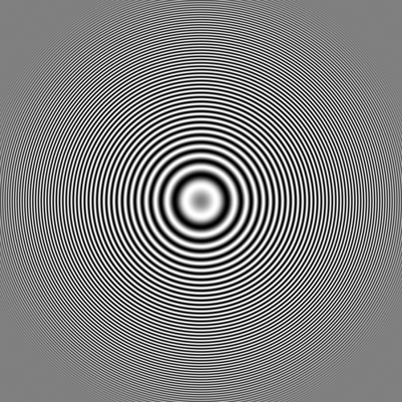

# Zone Plate Test Image

The MATLAB function `imzoneplate` creates an image with a radially symmetric pattern with low frequencies in the middle and high frequencies near the edge. It is useful for experimenting with frequency- and direction-sensitive filtering and also for testing the anti-aliasing capability of image resizing methods.
 
For more information, see:

- [Jähne test pattern - take 3](https://blogs.mathworks.com/steve/2011/07/19/jahne-test-pattern-take-3/)
- [Filtering fun](https://blogs.mathworks.com/steve/2011/07/22/filtering-fun/)

Copyright 2019 The MathWorks, Inc.